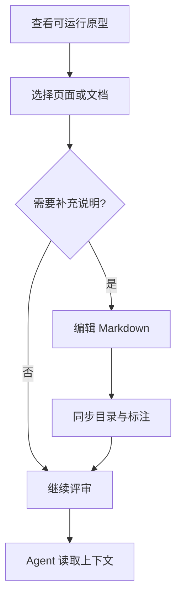

# 流程

## 1. 主流程

1. 先生成或维护可运行原型，让页面结构、交互路径和关键状态可以被直接查看。
2. 为关键节点补充内容标注，说明字段含义、业务规则、例外情况和设计判断。
3. 为需要评审的业务状态添加状态标注，例如成功、失败、空列表、指标偏低或偏高。
4. 页面目录组织原型页面和设计来源，PRD 从独立的文档目录分屏阅读。
5. 从原型顶部入口同时开启 PRD 和标注，可选择人工开启或 AI 开启；后续从文档管理编辑 PRD，通过 AI 或手动方式完善标注。
6. 开发 Agent 通过技能读取源码、标注、文档和截图，用于后续开发。

## 2. 页面流转

评审者从“原型即 PRD”理解整体理念，再通过“文档模式”阅读 PRD，进入“内容标注”“状态标注”和“页面目录”；最后查看“开启 PRD 和标注”“编辑 PRD 和标注”以及“Agent 读取”。

## 2.1 评审流程图

下面这张图用于验证 Mermaid 流程图在 Make 客户端文档中的渲染。

## 3. 异常处理

如果页面内容与文档描述不一致，以可运行原型为主，并在对应节点补充标注说明差异原因。
